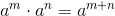
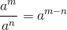
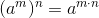
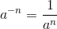
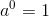

# What are exponents?

> ​	Before diving into the individual laws that govern exponents, you should first understand what exponents are. Feel free to jump to any section of this page and view a detailed explanation of each exponent law with examples and detailed solutions.

​	Exponents are a fancy way of expressing a number that is multiplied by itself multiple times. For example  would yeild the same result as  When reading exponents you wouldn't say *"ten times ten time ten times…"* instead you would say *"Ten to the fifth power."* or *"Ten to the power of five."* 

## Exponent Laws

### Multiplication & Division Laws

#### Multipication

#### Division

---

### A Power to a Power Law

---

### Negative and Zero Laws 

#### Negative

#### Zero

---